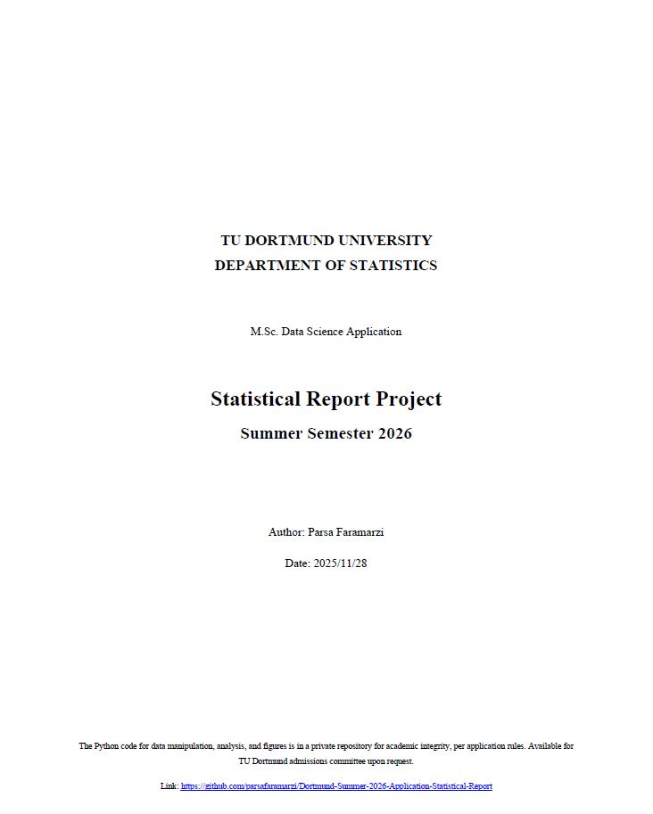

# 🚴‍♂️ TU Dortmund M.Sc. Data Science Application Report: Cycling Performance Analysis

This repository contains the complete **Python code** used to generate the statistical analysis and visualizations for the TU Dortmund Master's application report. This project granted me admission to [TUDO University](https://www.tu-dortmund.de/en/) for [Data Science MSc Programme](https://statistik.tu-dortmund.de/studium/studiengaenge/master-data-science/)

The analysis addresses the research questions concerning the relationship between **Rider Class**, **Stage Class**, and competitive **Points** performance in the dataset.
---

## 📄 Statistical Report
Click the image below to read the full 10-page report.

---

## 🛠️ 1. Environment Setup

This project requires a standard Python data science environment.

### 1.1. Clone the Repository (Private Access Only)

    git clone https://github.com/parsafaramarzi/Dortmund-Summer-2026-Application-Statistical-Report

### 1.2. Install Dependencies

All necessary packages can be installed using `pip`. It's recommended to do this within a virtual environment.

    pip install pandas numpy scipy scikit-posthocs matplotlib seaborn

* **Key Packages:** `scipy.stats` (for Kruskal-Wallis, Levene), `scikit_posthocs` (for Dunn's post-hoc test).

---

## 🚀 2. Running the Analysis

Execute the main script from the root directory:

    python analysis.py

The script will print the statistical test results (Levene's, Kruskal-Wallis, and Dunn's post-hoc matrices) to the console and save all generated figures and summary tables to the **`./output/`** folder.

---

*This repository was maintained as a private resource for the purpose of academic review for the M.Sc. Data Science application to TU Dortmund, Sommersemester 2026. Access was granted to public after the end of application and evaluation period.*
